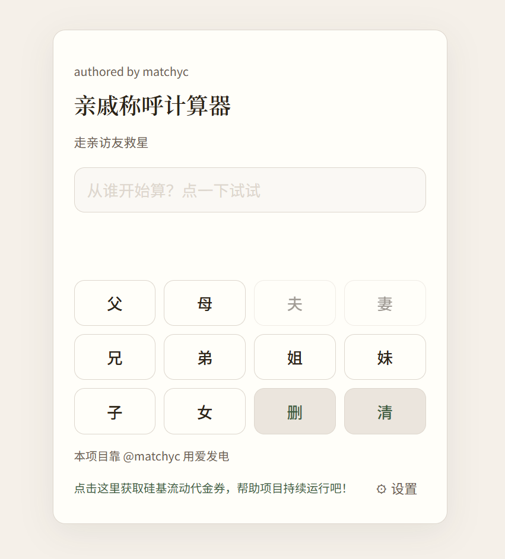

# 亲戚称呼计算器 · Vibe Family Call

> 过年走亲戚，再也不会对着「我爸的妈的哥」愣三秒。

一个极简的 Web 小工具：**用按钮点出关系链，让 AI 告诉你该叫啥**。  
从「我的 → 父 → 母 → 兄」点到「舅外公」，从此辈分不翻车。

---

## 为啥要做这个

亲戚一多，关系链一长，脑子就容易短路：

- 「我奶奶的妹妹的老公」—— 叫啥？
- 「我老婆的弟弟的媳妇」—— 咋称呼？
- 百度吧，要打字；问爸妈吧，他们也可能懵……

市面上基于规则的称呼计算器，结果往往不够友好，动不动就给你来一句「远房堂侄」「表姑丈的……」之类又长又拗口的表达，日常根本没人这么叫。

所以有了这个小东西：**你只管点「父 / 母 / 兄 / 弟 …」，交给大模型来给称呼**。  
像计算器一样好点，像真人一样好懂。

---

## 用爱发电

本项目靠 [@matchyc](https://github.com/matchyc) 用爱发电，无广告、无付费。  
API 跑在 [SiliconFlow 硅基流动](https://siliconflow.cn/) 上，若你愿意支持项目持续运行，可以：

**[👉 点击这里获取硅基流动代金券](https://cloud.siliconflow.cn/i/0nfuBLrj)** —— 新用户注册即送额度，用券的同时也能为项目带来一点支持，感谢。

---

## 能干啥

| 功能 | 说明 |
|------|------|
| **点按钮组关系** | 父、母、夫、妻、兄、弟、姐、妹、子、女，按「我的视角」一路点下去，自动变成「我的 xxx 的 xxx 的 xxx」 |
| **拿称呼** | 接 [SiliconFlow](https://siliconflow.cn/) API（默认 Qwen 模型），直接返回该怎么叫，比如「舅外公」「大舅子」 |
| **展开解释** | 结果旁边有个「更多」，点开能看到简短解释 |
| **一点小规矩** | 夫/妻按钮会按当前关系链智能禁用，逻辑参考 [mumuy/relationship](https://github.com/mumuy/relationship) |

界面故意做得有点**复古计算器 + 中式人情味**，再塞几句搞怪文案，用起来不无聊。

---

## 快速开始

站点已部署，打开即可用。

1. 若部署方式为 **Cloudflare Pages + Functions**：**无需任何配置**，直接点「父」「母」开始用。
2. 若为纯静态部署：点右下角 **⚙ 设置**，填 **Base URL** 和 **API Key**（仅支持 [SiliconFlow](https://siliconflow.cn/) 的 API），保存时会验证一次可用性。
3. 回到页面，从「父」「母」开始点，关系链会实时显示；有结果后可以点 **更多** 看解释。

自行部署见 **[deployment.md](./deployment.md)**。

---

## 技术栈

- 单页 HTML，内联 CSS + JS，**零构建、零依赖**
- 调用 OpenAI 风格的 `/v1/chat/completions`，Key 和 Base URL 只存在浏览器 `localStorage`，不上传、不落库

---

## 作者

authored by [matchyc](https://github.com/matchyc)

---

*辈分杀手 · 走亲访友救星 · 再也不怕叫错人*
